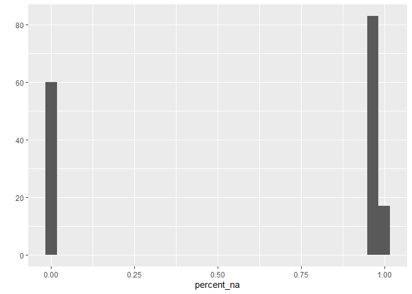
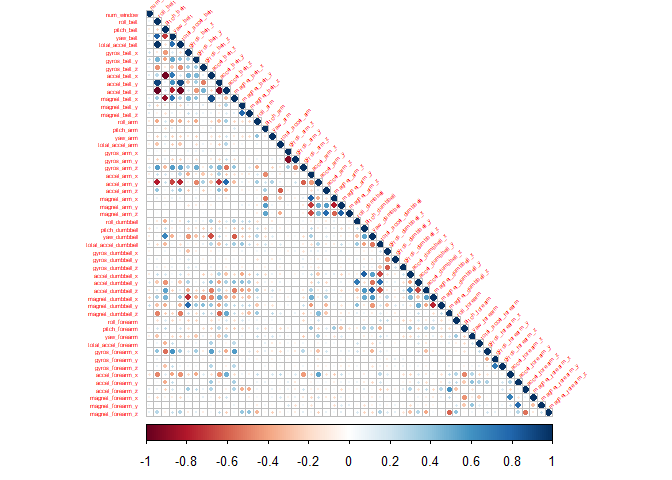
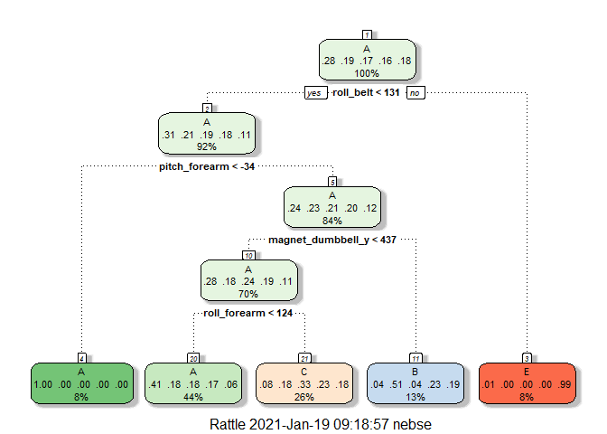

Practical Machine Learning (Coursera)
================

The goal of this course project is to demonstrate the use of developed
skills from the “Practical Machine Learning” course (Part of the Data
Science Specialization offered by JHU through Coursera) in a practical
data assessment. The dataset to be analyzed was assess by Velloso et al
(2013), which assessed six individuals engaged in a series of weight
lifting exercises (WLE), with several actigraphy and motor axis
variables constituting the breakdown of these WLE. This accelerometer
data was collected from four different locations on the participants; at
the forearm, arm, belt, and on the barbell being used in the WLE. These
barbell exercises were conducted correctly and incorrectly in five
different ways. The dataset, as well as further details related to its
collection process and the assessed variables, can be found at the
following website:
“<http://web.archive.org/web/20161224072740/http:/groupware.les.inf.puc-rio.br/har>”

For the purposes of this project, we were asked to use machine learning
(ML) techniques in analyzing both a training and testing set, the latter
of which is to be submitted in quiz format. My strategy in assessing the
training dataset was to construct a primary training and testing subset,
including the use of cross-validation techniques (CV), across three
primary types of potential models; random forest (rf), decision-tree,
and a boosted tree variant (gbm in this case). Next, I constructed
prediction models for the designated “testing” subject in order to
assess predictive respective accuracies of each model, selected the best
performing of the three, and finally used this model to assess the
bonafide “testing” set that was to be reported in the quiz. Below is the
code which accomplished these aforementioned tasks.

Although not shown in the code, the following packages are required in
order to complete the following commands as shown below. Please include
“install.package()” and “library()” commands for each of the follow
packages: **foreach, parallel, doParallel, tidyverse, caret, data.table,
corrplot, rattle, gbm, and ranger**.

### Download Dataset

Here, we are just downloading the dataset, checking the dimensions,
making sure that all variables (besides the outcome variable,
**classe**, which will be assigned as a “factor” class) are
numeric/integers, and finally make a basic split between the training
(comprising 70% of the data) and the testing subsets (comprising the
final 30%).

``` r
training_dl <- download.file("https://d396qusza40orc.cloudfront.net/predmachlearn/pml-training.csv", destfile = "pml-training.csv",mode="wb")
testing_dl <- download.file("https://d396qusza40orc.cloudfront.net/predmachlearn/pml-testing.csv", destfile = "pml-testing.csv",mode="wb")
data_training <- fread("pml-training.csv", header = T, na.strings=c("","NA"))
data_testing <- fread("pml-testing.csv", header = T, na.strings=c("","NA")) 
dim(data_training)
```

    ## [1] 19622   160

``` r
dim(data_testing)
```

    ## [1]  20 160

``` r
str(data_training$classe)
```

    ##  chr [1:19622] "A" "A" "A" "A" "A" "A" "A" "A" "A" "A" "A" "A" "A" "A" "A" ...

``` r
data_training$classe <- as.factor(data_training$classe)
dt <- as.data.frame(data_training)
inTrain <- createDataPartition(y=dt$classe,p=0.7, list=FALSE)
training <- data_training[inTrain,]
testing <- data_training[-inTrain,]
```

### Data cleaning, Correlation analysis

Next, ML techniques require that we have a tidy dataset comprised of
full columns and rows. To assess our dataset in its crude state, we
construct a table to see if there are any variables with considerable
amounts of missing values.

``` r
percent_na <- colMeans(is.na(training))
table(percent_na)
```

    ## percent_na
    ##                 0 0.979981073014486 0.980053869112616 0.980126665210745 
    ##                60                67                 2                 5 
    ## 0.980345053505132 0.980417849603261  0.98056344179952 0.981655383271457 
    ##                 1                 4                 2                 2 
    ## 0.983620877920943 0.983693674019073 0.983839266215331 0.984203246705977 
    ##                 1                 1                 2                 1 
    ## 0.984276042804106 0.984348838902235                 1 
    ##                 4                 2                 6

``` r
qplot(percent_na)
```

    ## `stat_bin()` using `bins = 30`. Pick better value with `binwidth`.

<!-- -->

From the above table, it is clear that there is a bimodal in column
percentages of missing data, with many comprised almost completely with
missing data, and a few remainders with almost no missing data. These
are the variables we want to preserve and conduct ML on, which is what
we accomplished in the subsequent code.

``` r
training_cut <-filter(subset(training,select=colMeans(is.na(training))<0.75))
```

Next, we decided to screen for variables with virtually zero variance in
their values, as these will likely not be useful to include in our ML
models.

``` r
nsv <- nearZeroVar(training_cut,saveMetrics=T)
nsv_remove <- nsv %>% filter(nzv==T)
nsv_remove
```

    ##            freqRatio percentUnique zeroVar  nzv
    ## new_window  48.95273    0.01455922   FALSE TRUE

``` r
training_cut2 <- training_cut %>% select(-new_window)
```

From the above assessment, only one variable (**new\_window**) met this
threshold and was consequently removed from the dataset.

Finally, we need to remove all time and identifier variables, as these
will not be analyzable by our ML models. Columns 1-5 meet this
qualification, and are therefore removed from the ML dataset.

``` r
table(sapply(training_cut2, class))
```

    ## 
    ## character    factor   integer   numeric 
    ##         2         1        29        27

``` r
training_cut3 <- training_cut2[, -(1:5)]
dim(training_cut3)
```

    ## [1] 13737    54

``` r
table(sapply(training_cut3, class))
```

    ## 
    ##  factor integer numeric 
    ##       1      26      27

With the above table command, we confirm that all rows in the above
dataset appear to be the correct type, which suggests that this dataset
can now be assessed with ML. From the dim command, we see that our
original dataset with 160 variables has now been reduced to 54.

Next, we want to take a brief exploratory look at the correlations
between all of these variables, just to see if there is anything
particularly interesting that might emerge.

``` r
covariate_matrix <- training_cut3 %>% select(-classe) %>% cor()
corrplot(covariate_matrix,type="lower", tl.cex= .4, tl.srt=45)
```

<!-- -->

From my eye, nothing really pops out immediately, so I then proceed to
the standard process of ML.

Below are the models for each of the respective types: random forest,
decision tree, and tree boosting. Each model is repeated with minimal
changes across validation techniques and additional default values in
order to focus on their comparative performances regarding prediction
accuracy.

### ML - random forest (rf)

**NOTE** For the rf calculations below, I deviated somewhat from the
course in that I sought out a more modern R package that could leverage
the use of parallel processing for the random forest computation in
order to speed up analysis time; the package I ended up using is titled
“ranger” (described as method=“ranger” in the command below). Note
that the base “rf” method which comes with the caret package will arrive
at the same accuracy and prediction values (which, although not shown,
was repeated on my dataset in order to confirm this assertion.)

``` r
set.seed(11111)
rf_fit <- train(classe ~., method="ranger", data=training_cut3, trControl=trainControl(method="cv", number=3, verboseIter=FALSE))
confusionMatrix(testing$classe, predict(rf_fit,testing, predict.all=TRUE))
```

    ## Confusion Matrix and Statistics
    ## 
    ##           Reference
    ## Prediction    A    B    C    D    E
    ##          A 1673    0    0    0    1
    ##          B    1 1137    1    0    0
    ##          C    0    1 1025    0    0
    ##          D    0    0    3  961    0
    ##          E    0    0    0    3 1079
    ## 
    ## Overall Statistics
    ##                                           
    ##                Accuracy : 0.9983          
    ##                  95% CI : (0.9969, 0.9992)
    ##     No Information Rate : 0.2845          
    ##     P-Value [Acc > NIR] : < 2.2e-16       
    ##                                           
    ##                   Kappa : 0.9979          
    ##                                           
    ##  Mcnemar's Test P-Value : NA              
    ## 
    ## Statistics by Class:
    ## 
    ##                      Class: A Class: B Class: C Class: D Class: E
    ## Sensitivity            0.9994   0.9991   0.9961   0.9969   0.9991
    ## Specificity            0.9998   0.9996   0.9998   0.9994   0.9994
    ## Pos Pred Value         0.9994   0.9982   0.9990   0.9969   0.9972
    ## Neg Pred Value         0.9998   0.9998   0.9992   0.9994   0.9998
    ## Prevalence             0.2845   0.1934   0.1749   0.1638   0.1835
    ## Detection Rate         0.2843   0.1932   0.1742   0.1633   0.1833
    ## Detection Prevalence   0.2845   0.1935   0.1743   0.1638   0.1839
    ## Balanced Accuracy      0.9996   0.9993   0.9980   0.9981   0.9992

### ML - decision-tree (rpart)

``` r
tree_fit <- train(classe ~ .,method="rpart",data=training_cut3,trControl=trainControl(method="cv", number=3, verboseIter=FALSE))

fancyRpartPlot(tree_fit$finalModel)
```

<!-- -->

``` r
confusionMatrix(testing$classe, predict(tree_fit,testing))
```

    ## Confusion Matrix and Statistics
    ## 
    ##           Reference
    ## Prediction    A    B    C    D    E
    ##          A 1518   24  126    0    6
    ##          B  489  372  278    0    0
    ##          C  483   32  511    0    0
    ##          D  431  162  371    0    0
    ##          E  157  151  292    0  482
    ## 
    ## Overall Statistics
    ##                                          
    ##                Accuracy : 0.4899         
    ##                  95% CI : (0.477, 0.5027)
    ##     No Information Rate : 0.523          
    ##     P-Value [Acc > NIR] : 1              
    ##                                          
    ##                   Kappa : 0.3331         
    ##                                          
    ##  Mcnemar's Test P-Value : NA             
    ## 
    ## Statistics by Class:
    ## 
    ##                      Class: A Class: B Class: C Class: D Class: E
    ## Sensitivity            0.4932  0.50202  0.32383       NA  0.98770
    ## Specificity            0.9444  0.85089  0.88043   0.8362  0.88883
    ## Pos Pred Value         0.9068  0.32660  0.49805       NA  0.44547
    ## Neg Pred Value         0.6295  0.92225  0.78041       NA  0.99875
    ## Prevalence             0.5230  0.12591  0.26814   0.0000  0.08292
    ## Detection Rate         0.2579  0.06321  0.08683   0.0000  0.08190
    ## Detection Prevalence   0.2845  0.19354  0.17434   0.1638  0.18386
    ## Balanced Accuracy      0.7188  0.67646  0.60213       NA  0.93827

### ML - tree boosted (gbm)

``` r
gbm_fit <- train(classe ~ .,method="gbm",data=training_cut3,trControl=trainControl(method="cv", number=3, verboseIter=FALSE), verbose=FALSE)
confusionMatrix(testing$classe, predict(gbm_fit,testing))
```

    ## Confusion Matrix and Statistics
    ## 
    ##           Reference
    ## Prediction    A    B    C    D    E
    ##          A 1667    6    0    1    0
    ##          B   11 1117   10    1    0
    ##          C    0   10 1014    1    1
    ##          D    1    8   12  941    2
    ##          E    0    4    2    7 1069
    ## 
    ## Overall Statistics
    ##                                           
    ##                Accuracy : 0.9869          
    ##                  95% CI : (0.9837, 0.9897)
    ##     No Information Rate : 0.2853          
    ##     P-Value [Acc > NIR] : < 2.2e-16       
    ##                                           
    ##                   Kappa : 0.9834          
    ##                                           
    ##  Mcnemar's Test P-Value : NA              
    ## 
    ## Statistics by Class:
    ## 
    ##                      Class: A Class: B Class: C Class: D Class: E
    ## Sensitivity            0.9929   0.9755   0.9769   0.9895   0.9972
    ## Specificity            0.9983   0.9954   0.9975   0.9953   0.9973
    ## Pos Pred Value         0.9958   0.9807   0.9883   0.9761   0.9880
    ## Neg Pred Value         0.9972   0.9941   0.9951   0.9980   0.9994
    ## Prevalence             0.2853   0.1946   0.1764   0.1616   0.1822
    ## Detection Rate         0.2833   0.1898   0.1723   0.1599   0.1816
    ## Detection Prevalence   0.2845   0.1935   0.1743   0.1638   0.1839
    ## Balanced Accuracy      0.9956   0.9855   0.9872   0.9924   0.9973

### Assessment of ML model types

From the reported accuracy values of these models, it random forest is
the best performing with 99.58% accuracy (although the gbm model
performed almost as well at 98.93%; meanwhile, the decision tree ML
model performed much worse at only 49.36% accuracy). Therefore, we will
use the rf model in assessing the final testing set so as to predict the
“classe” for each row.

### Expected out-of-sample error (selected rf model)

Given our selection of the rf model, we can anticipate that the expected
out-of-sample error would be the difference between 1 and our accuracy,
0.9958; 1-0.9958 =0.0042. Given that there are only 20 samples in the
test set used for the quiz, it is quite likely that we will get all (or
nearly all) of the predictions correct.

### Quiz Submission - Test set prediction

``` r
prediction_quiz <- predict(rf_fit, newdata=data_testing)

classe<-as.matrix(prediction_quiz)
prediction_quiz <- as.factor(prediction_quiz)

quiz_data <- data_testing %>% select(1) 
df_quiz <- data.frame(quiz_data, classe)
df_quiz
```

    ##    V1 classe
    ## 1   1      B
    ## 2   2      A
    ## 3   3      B
    ## 4   4      A
    ## 5   5      A
    ## 6   6      E
    ## 7   7      D
    ## 8   8      B
    ## 9   9      A
    ## 10 10      A
    ## 11 11      B
    ## 12 12      C
    ## 13 13      B
    ## 14 14      A
    ## 15 15      E
    ## 16 16      E
    ## 17 17      A
    ## 18 18      B
    ## 19 19      B
    ## 20 20      B

Above are the predictions for each of the datapoints in the original
test dataset which were used for answering the requested quiz questions.
